<h1 align="center" style="text-decoration: none;  background-color: #F0FDF4;">E2E Test Automation With Selenium WebDriver and JAVA</h1>

## Technology Stack Table 

| **Component**        | **Tool**                        |
|----------------------|---------------------------------|
| Programming Language | Java                            |
| Automation Tool      | Selenium WebDriver              |
| Test Framework       | TestNG                          |
| Build Tool           | Maven                           |
| Pattern              | Page Object Model (POM)         |
| Reporting            | ExtentReports and Allure        |
| Logging              | Log4j2                          |
| Test Data Management | Internal Test Data              |
| Browser Driver Mgmt  | WebDriverManager                |
| Testing Process      | Regression                      |
| CI/CD Integration    | Jenkins  Azure DevOps           |
| Parallel Execution   | TestNG Parallel / Selenium Grid |

## Framework Process Flow Architecture Diagram (Visual Internal Flow)
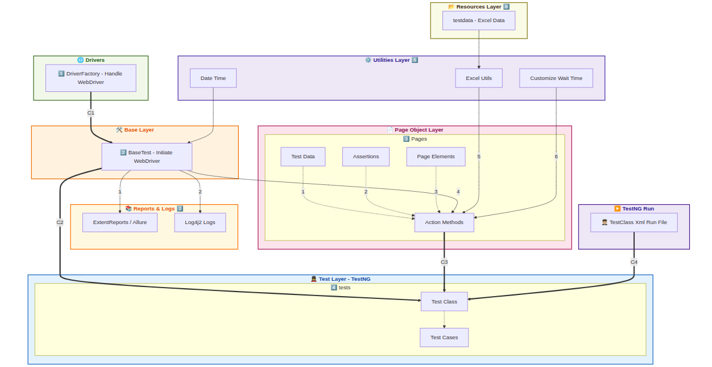

    Here's a beautified, fully structured Mermaid flowchart version of your Selenium + TestNG framework

## List of Tested Modules Including Features

<!DOCTYPE html>
<html>
<head>
  
</head>
<body>

<table>
  <tr>
    <th>Module</th>
    <th>Feature / Functionality</th>
  </tr>
  <tr>
    <td rowspan="5">User Management System (UMS)</td>
    <td>User Registration</td>
  </tr>
  <tr><td>User Login</td></tr>
  <tr><td>Update User Information</td></tr>
  <tr><td>Update Admin Information</td></tr>
  <tr><td>Logout</td></tr>
  <tr>
    <td>Account Management</td>
    <td>Open Account from Admin Panel</td>
  </tr>
  <tr>
    <td rowspan="3">Transaction</td>
    <td>Cash Deposit</td>
  </tr>
  <tr><td>Cash Withdrawal</td></tr>
  <tr><td>Fund Transfer</td></tr>
  <tr>
    <td rowspan="3">Report</td>
    <td>Cash Deposit History</td>
  </tr>
  <tr><td>Cash Withdrawal History</td></tr>
  <tr><td>Fund Transfer History</td></tr>
</table>

</body>
</html>

## 
 Extent Spark Report 

### <u> Format-1 <u/>
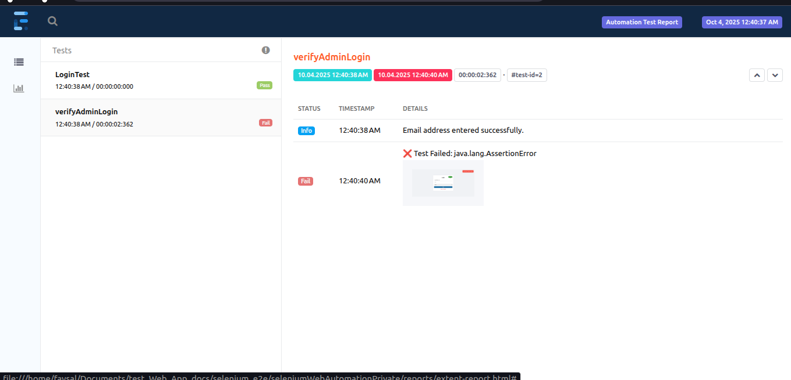
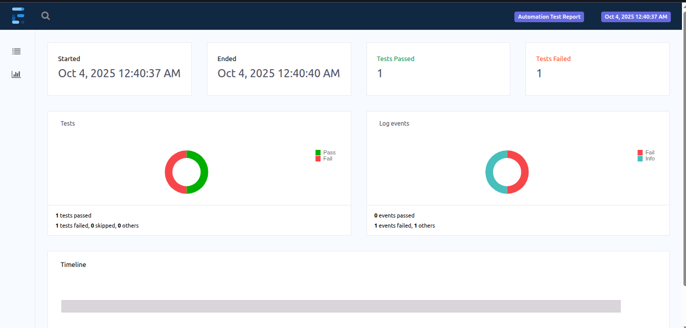
### <u> Format-2 <u/>
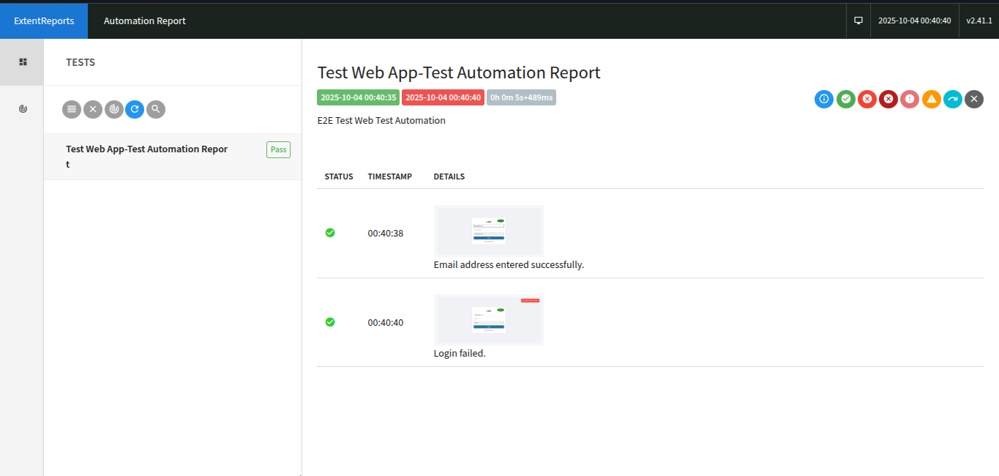
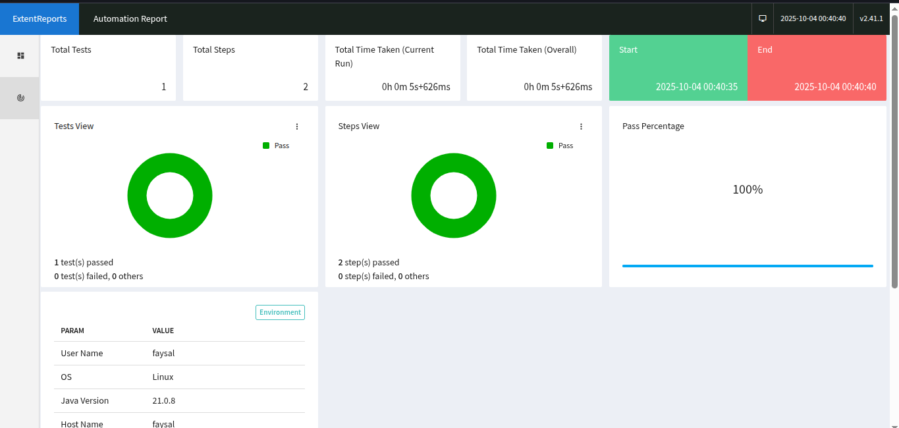
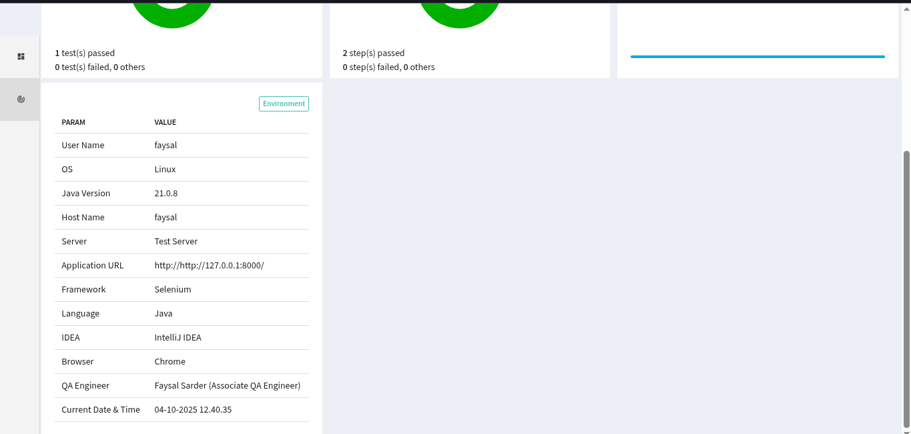

## 
 Log4j (Logs) 

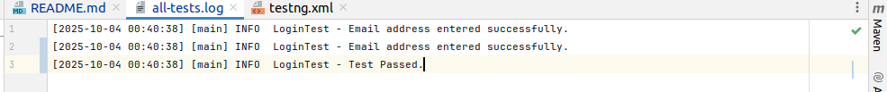

## 
 PROTOTYPE 

### Login
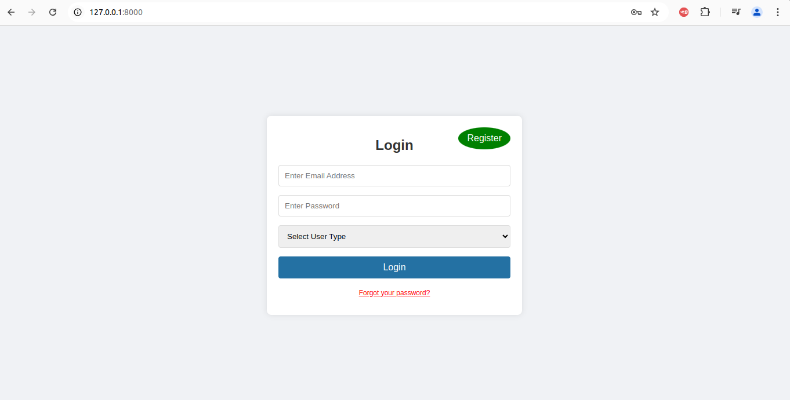

### Login and Registration
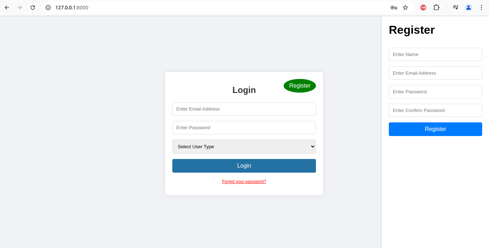

### Admin Information Change
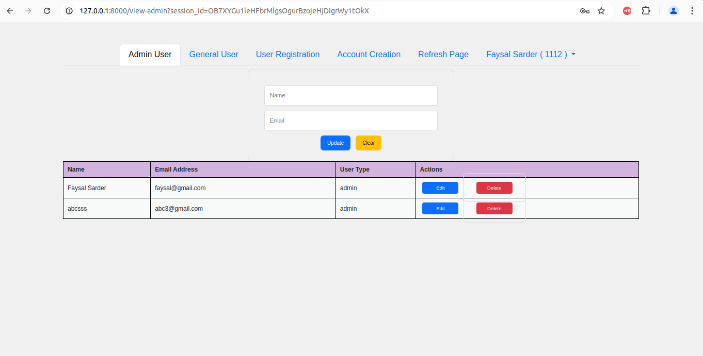

### Account Creation
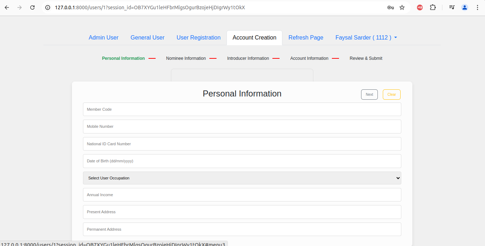

### Cash Deposit
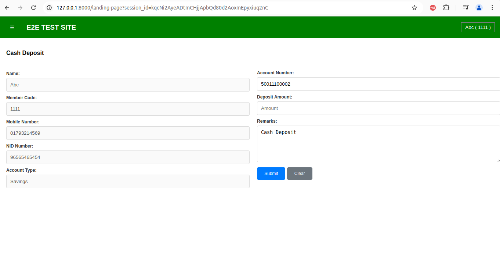
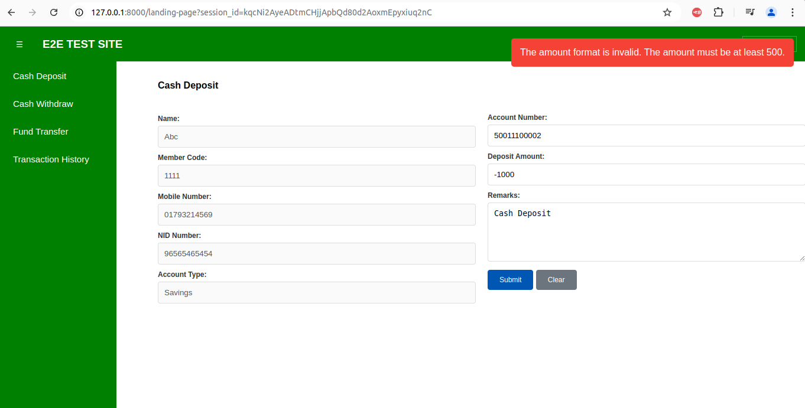

### Cash Deposit History
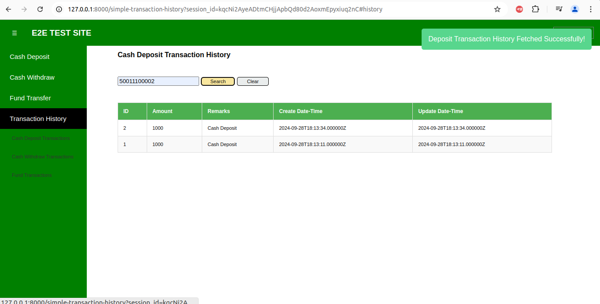